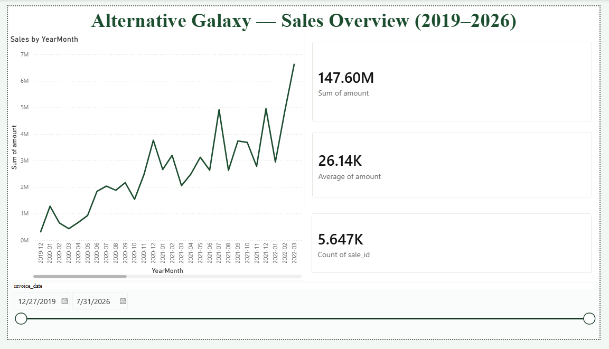
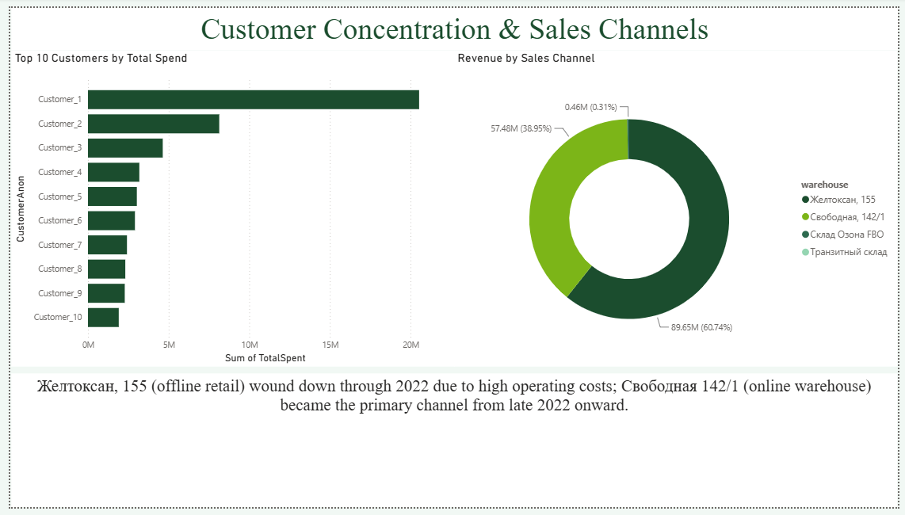
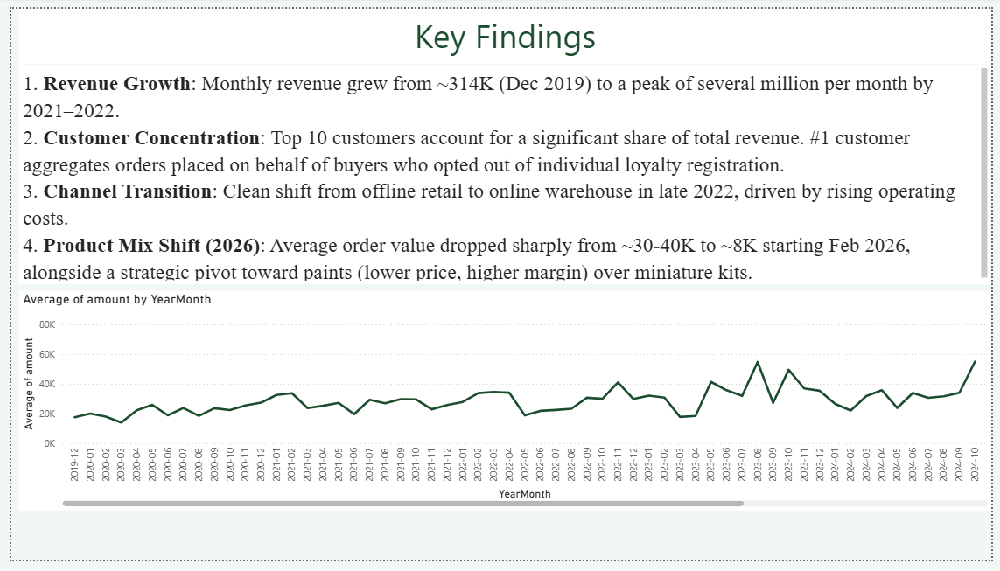

# Alternative Galaxy Sales Analysis

SQL and data analysis project based on the full sales history of Alternative Galaxy, 
a Warhammer miniatures and paints e-commerce business (Kazakhstan), covering 2019–2026 
(5,600+ orders).

## Data Source

Sales data exported from 1C:Enterprise (1C:УНФ), covering invoice-level records: date, 
customer, amount, sales channel. Customer names have been anonymized before publishing 
(replaced with sequential IDs, ranked by total spend).

## Tools

- MySQL (via XAMPP / phpMyAdmin) — data cleaning, transformation, analysis
- Power BI — dashboard and visualization

## Project Structure

SQL/ — all queries, in order of execution
results/ — CSV exports of query results
README.md

## Data Cleaning

- Fixed 4 records with corrupted date values (see `02_data_quality_fix.sql`)
- Removed thousand separators from currency values, converted to proper DECIMAL type
- Converted date strings to DATE type

## Dashboard

Three-page interactive Power BI dashboard:

**Overview** — monthly revenue trend, key metrics (total revenue, average order value, 
order count), and a date range slicer.

**Customers & Channels** — top 10 customers by spend and revenue breakdown by sales 
channel, with context on the offline-to-online transition.

**Key Insights** — written summary of the findings below, paired with a supporting chart.

## Key Findings

1. **Revenue growth**: monthly revenue grew from ~314K (Dec 2019) to a peak of several 
   million per month by 2021–2022, reflecting strong early business growth.

2. **Customer concentration**: the top 10 customers account for a significant share of 
   total revenue. Note: the #1 customer aggregates orders placed on behalf of buyers 
   who opted not to register individually in the loyalty program, not a single retail 
   customer.

3. **Offline-to-online transition**: sales data confirms a clean channel shift in late 
   2022 — the offline retail location ("Желтоксан") wound down through 2022, while the 
   online warehouse ("Свободная") ramped up in Nov–Dec 2022. This aligns with the 
   business closing its offline location due to high operating costs.

4. **Shift toward paints (2026)**: starting February 2026, average order value dropped 
   sharply (from ~30-40K to ~8K) while order count increased significantly. This 
   reflects a deliberate strategic shift toward paints (lower price point, higher 
   margin) over miniature kits.

## Limitations

- Source data is invoice-level only; no line-item (product-level) detail is available, 
  so product-level analysis (e.g. ABC analysis, category breakdown) was not possible 
  with this dataset.
- A small number of records (4 out of 5,647) had corrupted dates that were manually 
  corrected based on cross-referencing with the source system.
